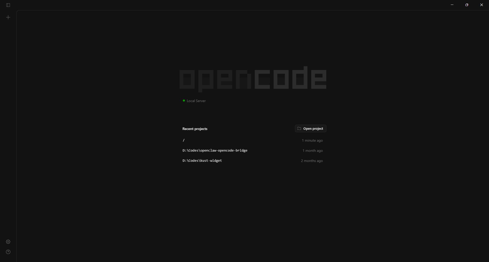
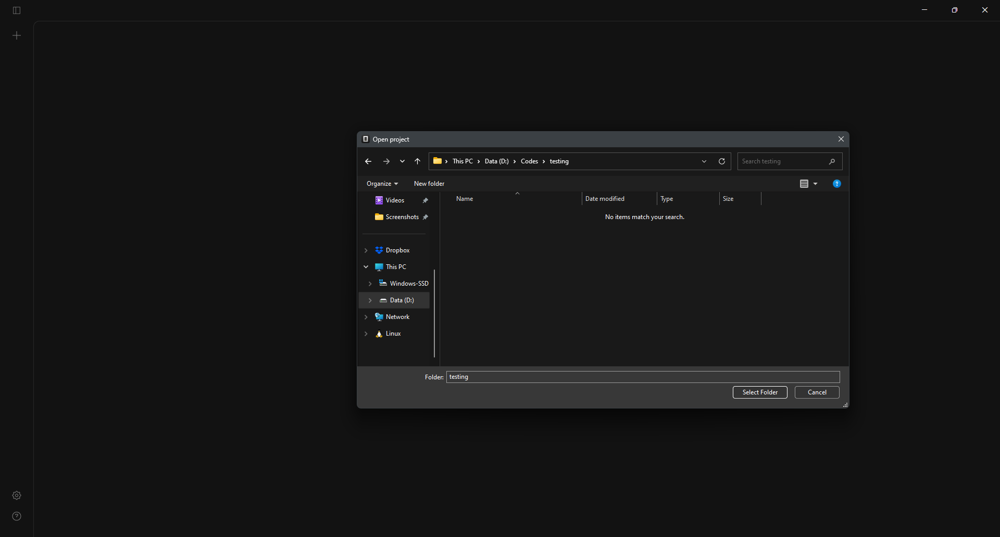
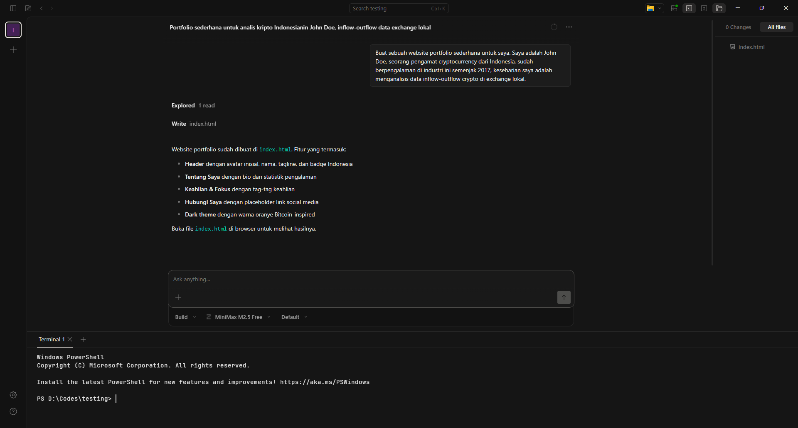
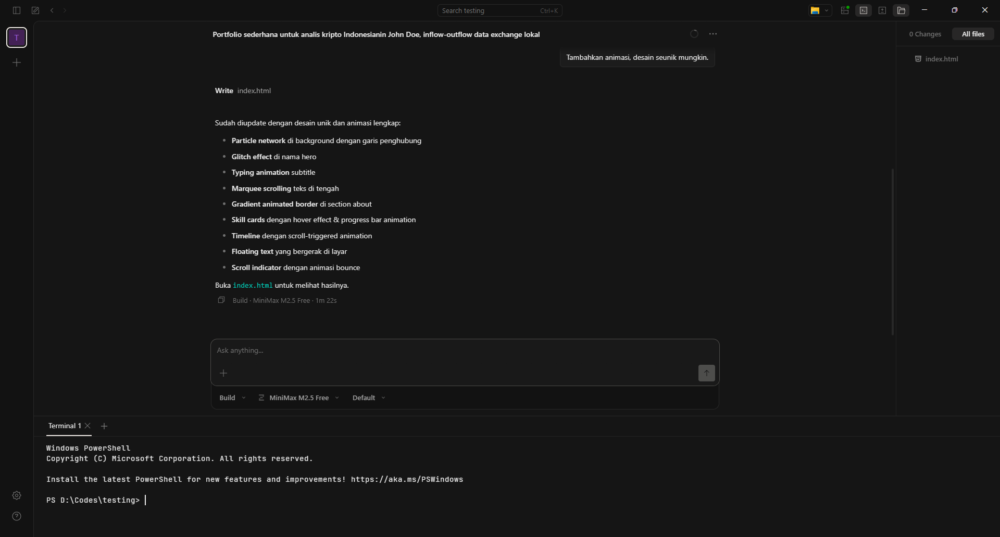
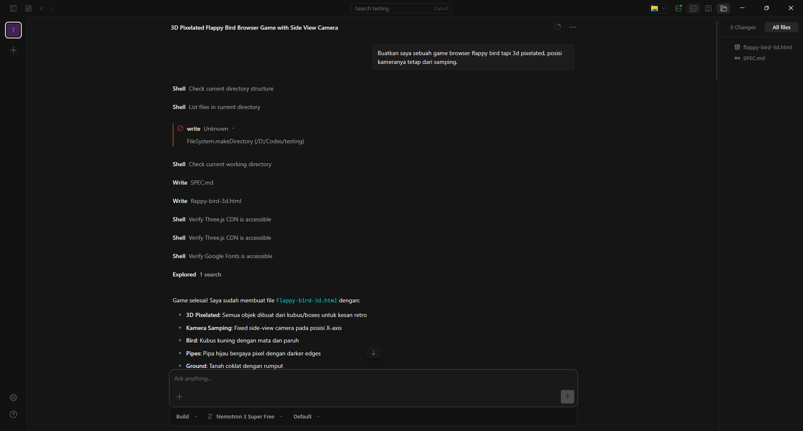
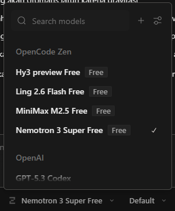

Tidak ada yang lebih indah dari ngetest website/blog hasil vibecoding dengan membahas vibecode wkwkwkw. Website ini gw bikin dari 0 hanya bermodalkan AI, tinggal ngeprompt doang, kasih screenshot sebagai referensi, ada error? bilang aja ke AI, dan boom jadi. Keknya lebih lama gw ngetik postingan ini ketimbang AI ngebuild website ini.

"Vibecode apaan njir?"

Pasti itu ada di benak kalian, ngaku ga lu? Gampangnya, vibecode tuh lu nyuruh AI fully untuk ngoding. Bisa bikin website, bisa bikin aplikasi, bisa bikin script botting, dan segala hal yang berkaitan dengan ngoding bisa dihandle oleh AI. Orang yang buta dengan programming juga bisa vibecode karena dari segi akses memang semudah itu. Ngga perlu belajar ngoding dulu, tinggal suruh AI "Bro bikinin gw website portfolio dong" bisa langsung jadi saat itu juga. Mau deploy website lu ke internet biar bisa diakses orang? Yaaa tinggal tanya AI lagi caranya gimana, kalo perlu suruh dia yang deploy, terima beres aja deh pokoknya 😂

Enak kan? Pastinya. Sekarang sudahi yapping ini, gw pengen share tutorial vibecode yang gratis tanpa biaya.

<strong>Gratisan artinya kalian hanya bisa memakai model seadanya, anggap aja ini sesi belajar kalian sebelum memutuskan untuk spend duit buat beli subscription AI macam ChatGPT atau Claude.</strong>

Pertama-tama langsung download dan install Opencode Desktop https://opencode.ai/download.

Setelah proses instalasi selesai, buka saja Opencodenya sampai kalian lihat user interface ini.

<figure class="vibecode-post__figure">
	
</figure>

Klik tombol "Open project". Disini kalian harus bikin folder khusus untuk project kalian, bisa kasih nama "testing" kalo mau.

<figure class="vibecode-post__figure">
	
</figure>

Interface baru akan kebuka yang isinya cuma chatbox doang, kalian tinggal ketik aja mau bikin apa, contoh disini gw mau bikin website portfolio. Oh ya, kalian bisa ganti model AI nya, untuk user gratisan cuma tersedia 4 free model.

<figure class="vibecode-post__figure">
	
</figure>

Setelah gw cek ternyata ga sesuai yang gw harapkan, akhirnya gw minta AI untuk tambahin animasi dan desain seunik mungkin.

<figure class="vibecode-post__figure">
	
</figure>

Trus gw bilang ke AI untuk bikin game Flappy Bird yang bisa dijalanin di browser.

<figure class="vibecode-post__figure">
	
</figure>

Demo websitenya bisa kalian lihat langsung di bawah ini tanpa keluar dari halaman post:

<input class="demo-tabs__toggle" type="radio" name="vibecode-demo-tabs" id="vibecode-demo-portfolio" checked />
<input class="demo-tabs__toggle" type="radio" name="vibecode-demo-tabs" id="vibecode-demo-flappy" />

<label class="demo-tabs__tab" for="vibecode-demo-portfolio">Portfolio</label>
<label class="demo-tabs__tab" for="vibecode-demo-flappy">Flappy Bird</label>
<a class="demo-tabs__external demo-tabs__external--portfolio" href="./assets/demo/portfolio-demo.html" target="_blank" rel="noreferrer" aria-label="Buka tab baru untuk demo Portfolio">
<svg viewBox="0 0 20 20" aria-hidden="true" fill="none" stroke="currentColor" stroke-width="1.8" stroke-linecap="round" stroke-linejoin="round">
<path d="M7 13L13 7"></path>
<path d="M8 7H13V12"></path>
<path d="M13 11V14C13 14.5523 12.5523 15 12 15H6C5.44772 15 5 14.5523 5 14V8C5 7.44772 5.44772 7 6 7H9"></path>
</svg>
</a>
<a class="demo-tabs__external demo-tabs__external--flappy" href="./assets/demo/flappy-demo.html" target="_blank" rel="noreferrer" aria-label="Buka tab baru untuk demo Flappy Bird">
<svg viewBox="0 0 20 20" aria-hidden="true" fill="none" stroke="currentColor" stroke-width="1.8" stroke-linecap="round" stroke-linejoin="round">
<path d="M7 13L13 7"></path>
<path d="M8 7H13V12"></path>
<path d="M13 11V14C13 14.5523 12.5523 15 12 15H6C5.44772 15 5 14.5523 5 14V8C5 7.44772 5.44772 7 6 7H9"></path>
</svg>
</a>

<section class="demo-tabs__panel demo-tabs__panel--portfolio">
<iframe class="demo-tabs__frame" src="./assets/demo/portfolio-demo.html" title="John Doe Portfolio" loading="lazy"></iframe>
</section>
<section class="demo-tabs__panel demo-tabs__panel--flappy">
<iframe class="demo-tabs__frame" src="./assets/demo/flappy-demo.html" title="Flappy Bird 3D" loading="lazy"></iframe>
</section>

Free model yang gw pake Minimax M2.5 dan Nemotron 3 Super. 

Untuk ukuran free model bisa dibilang bagus, menurut gw ini cukup untuk side project atau untuk orang-orang yang kepengen nyemplung ke dunia vibecode.

<figure class="vibecode-post__figure vibecode-post__figure--compact">

</figure>

